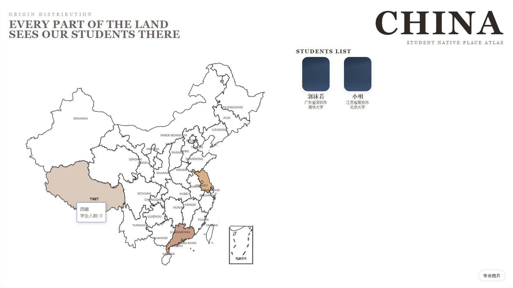

# echarts 蹭饭图
使用echarts 画出中国地图，通过读取person.xlsx文件得到对应信息，
绘制出来。
## index.html用法
1. 替换person.xlsx为对应excel文件
2. 在项目目录运行 `python -m http.server 8000`或用vscode的live server插件启动
3. 浏览器访问`http://127.0.0.1:8000/index.html`
4. 微调地图位置，导出图片即可
5. ## class.html用法
1. 整理excel文件和对应证件照到一个文件夹中，证件照命名与excel中的学号一一对应。
2. 替换class.html代码中读取的文件位置（500-505行，可以搜索“切换班级时”）
3. 在项目目录运行 `python -m http.server 8000`或用vscode的live server插件启动
4. 浏览器访问`http://127.0.0.1:8000/class.html`
5. 按照人数调整代码中设置的列数，默认5列，最大7列（位置在215行:`grid-template-columns: repeat(5, minmax(0, 1fr));`，把“5”替换成想要的列数）微调地图位置，导出。
## 图片模版
- index.html:籍贯图，有颜色填充和右侧名字、籍贯列表。实测50人左右效果最好。
- class.html:有头像、籍贯以及去向，适合28人以下使用，20人左右效果最好。

## 参考
本项目参考自[xiaofan9](https://github.com/xiaofan9/echarts-china-map)

## 效果预览

